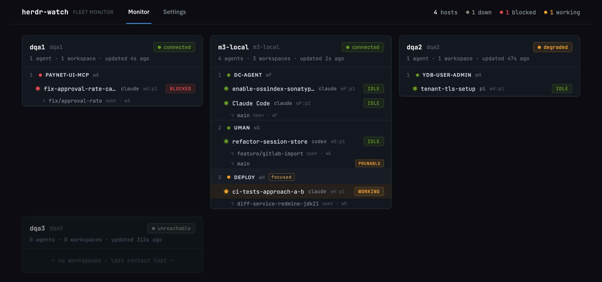
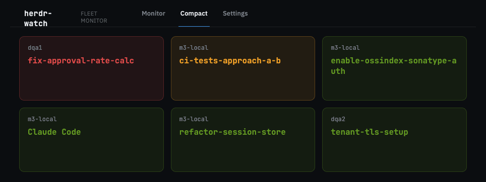
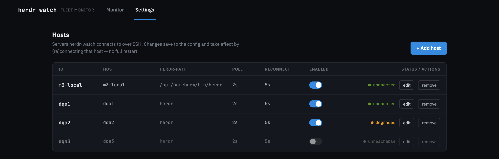
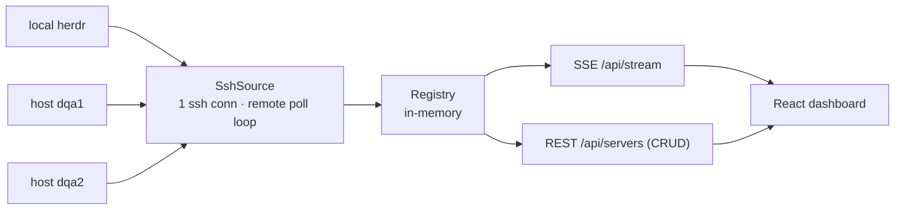

# herdr-watch

A read-only web dashboard that aggregates the live state of several
[`herdr`](https://github.com/ogulcancelik/herdr) servers — a terminal multiplexer for AI coding
agents — into one monitor: one local machine plus remote servers over SSH.

**Monitor** — host cards → workspace groups → agent rows → nested worktrees, with
per-host health badges, priority sorting (blocked on top), and a live summary bar.



**Compact** — one equal-size card per agent for small glance displays; status is
shown by color alone (host on top, agent label below).



**Settings** — a table of hosts with live health dots and an add/edit/remove form;
changes **(re)connect the host on the fly — no restart**.



> Screenshots are rendered from the design prototype in `handoff/` (mock fleet data).

There is no federation between `herdr` servers (each is a separate process with
its own Unix socket), so herdr-watch fans out over SSH, keeps one long-lived
connection per host, polls each one, and merges everything into a single
consistent view streamed to the browser over SSE. The machine running the backend
can also be read **directly, without SSH** (a host with `local: true`), so the
current user's own `herdr` session shows up alongside the remote ones.



Three views, switched by the top nav (**Monitor · Compact · Settings**):

- **Monitor** — host cards → workspace groups → agent rows → nested worktree
  rows, with per-host health badges, priority sorting (blocked on top,
  unreachable dimmed at the bottom), and a live summary bar.
- **Compact** — a grid of equal-size cards, one per agent, for small glance
  displays (~7"): status shown **only by color**, host on top, agent label below.
  The label (project / task / both) is configurable on the Settings screen.
- **Settings** — a table of hosts with a live health dot and an add/edit/remove
  form. Adding, editing, or removing a host **(re)connects it on the fly — no
  restart**. Also holds the Compact display preference.

When the backend is unreachable, an amber **“backend disconnected — reconnecting…”**
bar appears across the top on every screen, and the last-known data stays visible.

---

## Install (download from Releases)

The easy way — no building, no developer tools. Grab a ready-made file from the
[**Releases page**](https://github.com/evsinev/herdr-watch/releases/latest). (The numbers
in a file name, like `v0.0.4`, are just the version.)

### 1. The dashboard (the web app)

Download the one file that matches your computer:

| Your computer | File to download |
|---|---|
| **Mac** (Apple Silicon / M1–M4) | `herdr-watch-<version>-macos-arm64` |
| **Windows** | `herdr-watch-<version>-windows-amd64.exe` |
| **Linux** | `herdr-watch-<version>-linux-amd64` |

Then start it:

- **Mac** — open the **Terminal** app, drag the downloaded file into the window, press
  **Enter**. The first time, macOS may say it *“cannot verify the developer”*: open
  **System Settings → Privacy & Security**, scroll down, and click **Open Anyway**, then
  try again. (The app just isn't code-signed.)
- **Windows** — double-click the `.exe`. If a blue **“Windows protected your PC”** box
  appears, click **More info → Run anyway** (again, it's just unsigned).
- **Linux** — in a terminal: `chmod +x herdr-watch-*-linux-amd64` then
  `./herdr-watch-*-linux-amd64`.

Leave that window open and go to **http://localhost:8080** in your browser.

#### Windows notes

herdr-watch reads a **local** herdr on Windows through herdr's **socket API** (no `bash`
or `jq` needed) — the shipped default host `local` is already set to `data-source: SOCKET`.
A few Windows-specific things:

- **Runtime:** the socket transport uses Java's `AF_UNIX` sockets. This is fully supported
  by a **JRE 21 on Windows 10/11**, so the most reliable option is the **fat-jar**:
  `java -jar herdr-watch-<version>.jar`. If the native `.exe` exits right after start, use
  the jar instead. (`AF_UNIX` in the GraalVM *native* image on Windows is not yet verified.)
- **Socket path:** the local host expects herdr's socket at
  `C:\Users\<you>\.config\herdr\herdr.sock`. If your herdr uses a different location, set it
  per-host in **Settings** (`socketPath`) or via the `HERDR_SOCKET_PATH` environment
  variable. If the socket isn't found, the host shows **degraded** (grey) — the app keeps
  running; it won't exit.
- **SSH hosts:** connection multiplexing (`ControlMaster`) is skipped automatically on
  Windows, since Windows OpenSSH doesn't implement it.

> If herdr on Windows exposes its API over a **named pipe** or **TCP** instead of a unix
> socket file, the socket source can't reach it yet — please open an issue with the
> transport/path so it can be supported.

### 2. The menu-bar app (Mac only, optional)

A small icon in the top menu bar that shows your fleet at a glance and pops up a
notification when an agent needs input or finishes.

1. Download `herdr-watch-tray-<version>-macos-arm64.zip` and double-click it to unzip.
2. **Right-click** `HerdrWatchTray.app` → **Open** (needed the first time — it's unsigned).
3. Click **Allow** when it asks about notifications.

---

## After installing — what to do

1. Open **http://localhost:8080** — you'll see the dashboard (empty at first).
2. Go to **Settings** and add the servers you want to watch: an **id** (any name you
   like) and the **ssh host** (a name from your `~/.ssh/config`, or `user@host`). Each
   server needs `herdr` + `jq` installed and passwordless SSH — see
   [Remote host requirements](#remote-host-requirements).
3. Use the top menu to switch between **Monitor** (full view), **Compact** (big
   glance screen), and **Settings**.
4. **Menu-bar app:** click its icon → **Settings…**, set the server address (default
   `http://localhost:8080`), and optionally turn on **Launch at Login**.

> Want to build from source or run in Docker instead? See **Prerequisites** and **Run it** below.

---

## Kiosk display

The **Compact** view is meant for a wall-mounted panel. On a Raspberry Pi, skip the
desktop browser: `cog` (WPE WebKit straight on DRM/KMS) drops the same dashboard
from load average 1.64 to 0.11 and from 555 MiB to ~300 MiB on a Pi 3.
See [docs/raspberry-pi-kiosk.md](docs/raspberry-pi-kiosk.md).


## Prerequisites

| | Version | Notes |
|---|---|---|
| **JDK** | 21 | virtual threads, records |
| **Maven** | 3.8.6+ | Quarkus dev requires it. This repo ships a **Maven Wrapper** (`backend/mvnw`) pinned to 3.9.9 — use it if your system `mvn` is older. |
| **Node** | 18+ (tested on 24) | for the Vite frontend |
| **ssh, jq** | any recent | `ssh` on the machine running the backend; `jq` on each **remote** host |

### Remote host requirements

Each monitored host must have:

- **`herdr` in `PATH`** (or set a per-host `herdr-path`),
- **`jq`** installed,
- **passwordless SSH** from the backend machine (key/agent auth; the backend
  connects with `BatchMode=yes`, so no interactive prompts).

> **herdr output:** the remote frame command runs `herdr workspace list`,
> `herdr agent list`, and `herdr worktree list --workspace <id>` — `herdr`
> already emits JSON, so no `--json` flag is passed. A host whose `herdr` returns
> nothing (e.g. no active session for the ssh user) connects over SSH but reports
> **degraded**. Note the polled session belongs to the **ssh user** on that host.

---

## Run it

Frontend and backend ship as **one Quarkus app** (via the
[Quinoa](https://docs.quarkiverse.io/quarkus-quinoa/dev/) extension). Everything
runs on **:8080** — UI at `/`, API under `/api`.

### Dev — one command

```bash
cd backend
./mvnw quarkus:dev          # Quarkus + Vite (HMR); open http://localhost:8080
```

Quinoa starts the Vite dev server and proxies to it, so a single command gives you
live-reload UI and the live backend. Open **http://localhost:8080**.

### Production — one artifact

```bash
cd backend
./mvnw package                                   # builds ../frontend into the jar
java -jar target/quarkus-app/quarkus-run.jar     # UI + API on http://localhost:8080
```

Prefer a **single self-contained fat jar** (one file, easy to copy/run) — build with
the `uber` profile:

```bash
cd backend
./mvnw package -Puber                                    # → target/herdr-watch-<version>-runner.jar
java -jar target/herdr-watch-1.0.0-SNAPSHOT-runner.jar   # UI + API on :8080 (deps + frontend inside)
```

> Building requires Node/npm on the machine (Quinoa runs `npm install && npm run
> build` in `../frontend`). Uses system Node — no separate install step.
> Run only **one** server on :8080 at a time (dev, fast-jar, or fat-jar).

### Native binary (GraalVM, macOS)

A standalone native executable (fast startup, no JVM). Use GraalVM **for JDK 21**
(matches Quarkus 3.15):

```bash
sdk install java 21.0.12-graal             # one-time — GraalVM for JDK 21
cd backend
JAVA_HOME=~/.sdkman/candidates/java/21.0.12-graal \
GRAALVM_HOME=~/.sdkman/candidates/java/21.0.12-graal \
./mvnw package -Dnative                     # → target/herdr-watch-<version>-runner  (takes a few min)
./target/herdr-watch-1.0.0-SNAPSHOT-runner  # UI + API on :8080
```

Needs Xcode Command Line Tools and Node/npm (Quinoa builds the frontend into the
image). Produces an arch-native macOS binary (arm64 on Apple Silicon). A container
build (`-Dquarkus.native.container-build=true`) would produce a **Linux** binary.

Quick smoke test (either mode):

```bash
curl -s -o /dev/null -w '%{http_code}\n' http://localhost:8080/   # 200 (index.html)
curl http://localhost:8080/api/servers                            # host list + health
curl -N http://localhost:8080/api/stream                          # snapshot, then deltas
```

<details>
<summary>Standalone frontend dev (optional)</summary>

You can still run Vite on its own — it proxies `/api` → :8080:

```bash
cd frontend && npm install && npm run dev   # http://localhost:5173
```
</details>

---

## Configuring hosts

There are two layers:

1. **Bootstrap (read-only)** — `backend/src/main/resources/application.yaml`,
   under `herdr-watch.hosts`. Good for seeding the initial fleet.
2. **State file (writable)** — everything you add/edit/remove in the **Settings**
   UI is persisted to `~/.config/herdr-watch/hosts.json` and layered **on top**
   of the bootstrap list (the state file wins). The bootstrap file is never
   written to. Removing a bootstrap host records a tombstone so it does not
   reappear on restart.

   > Override the location with `-Dherdr-watch.state-file=/path/to/hosts.json`.

Per-host fields (bootstrap YAML uses kebab-case; the API/state file use
camelCase):

| field | default | meaning |
|---|---|---|
| `id` | — | logical name shown in the UI (must be unique) |
| `host` | — | ssh target: `~/.ssh/config` alias or `user@host` |
| `herdr-path` / `herdrPath` | `herdr` | path to `herdr` on the remote |
| `poll-interval` / `pollInterval` | `2` | remote poll cadence, seconds |
| `reconnect-delay` / `reconnectDelay` | `5` | pause before reconnecting after a drop, seconds |
| `enabled` | `true` | whether to connect this host |
| `local` | `false` | read the **local** `herdr` directly (current user, no SSH); `host` is just a label then |
| `ssh-extra-opts` / `sshExtraOpts` | — | optional extra `ssh` flags |

A **local** host needs `herdr` + `jq` on the machine running the backend; there's no
SSH, so it reads the herdr session of the user who launched herdr-watch.

---

## API

| Method | Path | Purpose |
|---|---|---|
| `GET` | `/api/stream` | SSE. First a `snapshot` (all hosts), then `host_update` / `host_remove` deltas. |
| `GET` | `/api/servers` | Host list with config + live health (drives the Settings table). |
| `GET` | `/api/claude-usage` | Current Claude subscription quota (see [Claude quota gauge](#claude-quota-gauge)). |
| `POST` | `/api/servers` | Add a host, connect it if enabled. |
| `PUT` | `/api/servers/{id}` | Edit a host (stop + start with new params). |
| `DELETE` | `/api/servers/{id}` | Remove a host, disconnect it, drop its card. |
| `GET` | `/q/health` | Health check (`/q/health/live`, `/q/health/ready`); readiness includes a fleet summary. |

Validation errors come back as `400` with field-level messages in the
interface's own voice, e.g.:

```json
{ "errors": { "host": "Enter an ssh target", "pollInterval": "Use a positive whole number" } }
```

SSE events are plain `message` events carrying `{ "type": ..., "data": ... }`;
the frontend switches on `type` (`snapshot` | `host_update` | `host_remove` |
`claude_usage` | `ping`). Unknown types are ignored, so a client written before
`claude_usage` existed keeps working unchanged.

---

## Health states

| health | color | meaning |
|---|---|---|
| `CONNECTED` | green | frames flowing, `herdr` responding |
| `DEGRADED` | amber | SSH alive but `herdr` returned no data |
| `UNREACHABLE` | grey | SSH down / reconnecting — card dims, last-known state stays visible |

---

## Claude quota gauge

Shows how much of the Claude subscription's **5-hour session window** and
**weekly window** is used up, with reset times, inline on the **local** host's
card — so a stall at 100 % is something you see coming rather than discover.

The figures belong to the Claude **account**, not to the machine, and the gauge
says so. Remote hosts never show one.

### How the numbers get in

Not over the network, and with no credential anywhere. Claude Code already hands
the quota to whatever `statusLine` command you configure. herdr-watch ships a
**pass-through hook**: it records the numbers, then forwards stdin untouched to
your real statusline command. Your own script is not modified.

Install by wrapping your existing `statusLine` command in `~/.claude/settings.json`:

```json
"statusLine": {
  "type": "command",
  "command": "python3 /path/to/herdr-watch/scripts/herdr-watch-statusline-hook.py python3 ~/.claude/statusline.py"
}
```

Everything after the hook's own path is your command, run exactly as before. If
you have no statusline yet, `... hook.py echo ""` records the quota and prints
nothing.

**To remove it:** delete the wrapper prefix from that one line, and (optionally)
`rm ~/.config/herdr-watch/claude-usage.json`. Nothing else persists.

The hook is on an interactive path, so it is built to be invisible: any failure —
unwritable path, malformed payload, no quota in the payload — is swallowed, stdin
is still forwarded, and the exit status is your command's. It never writes to
stdout itself. Cost: one extra Python start (~30 ms) per statusline refresh.

### Staleness is the normal state, not a bug

**The numbers only advance while a Claude Code session is running.** With no
session open, the newest reading simply ages. herdr-watch shows the capture time
next to every reading and dims the gauge once it passes
`herdr-watch.claude-usage.stale-after` (default 15 min) — old figures are still
shown, marked stale, rather than silently passing for current.

Before the hook is installed nothing is rendered at all, and the API reports
`NOT_CONFIGURED`. That is not an error state.

### Configuration

```yaml
herdr-watch:
  claude-usage:
    state-file: ~/.config/herdr-watch/claude-usage.json   # what the hook writes
    poll-interval: 5s                                     # mtime check; parses only on change
    stale-after: 15m                                      # age at which a reading is marked stale
```

Colour bands (70 % warning, 90 % critical) live in `usage/UsageSeverity.java` and
are mirrored in `frontend/src/lib/theme.ts` — change them as a pair.

Embedded clients that cannot hold an SSE connection can poll
`GET /api/v1/snapshot/usage` instead; see §4a of
`docs/api/herdr-watch-snapshot-protocol.md`.

---

## Notifications (Telegram)

herdr-watch can push a Telegram message when an agent **needs input** (status
`blocked`) or **finishes a task** (status `done`). Messages fire only on the
status *transition*, so a still-blocked agent isn't re-sent; the first poll after
startup is a silent baseline.

Enable it with environment variables (off by default; secrets are never written to
the host state file):

```bash
export TELEGRAM_ENABLED=true
export TELEGRAM_BOT_TOKEN=123456:ABC...      # from @BotFather
export TELEGRAM_CHAT_ID=987654321            # target chat/user id
cd backend && ./mvnw quarkus:dev
```

Fine-tune which transitions notify in `application.yaml` under
`herdr-watch.telegram` (`notify-blocked`, `notify-done`). Every notification is
also logged at INFO (`telegram: ⛔ needs input — …`), so you can confirm behaviour
without a real bot.

---

## Troubleshooting / logs

The backend logs each source's lifecycle — one line per **state change** (no
per-poll spam), so it's clear what each host is doing. Typical lines:

```
[local] source starting — target=local, herdr=/opt/homebrew/bin/herdr, poll=2s, reconnect=5s
[local] connected to local — 7 workspace(s), 5 agent(s)
[dqa1] cannot reach ssh:dqa1 (…) — retry in 5s. check: passwordless SSH to dqa1 (BatchMode), host reachable, herdr in PATH (or herdr-path), jq installed on the remote
```

| log line | meaning | what to check |
|---|---|---|
| `connected to …` | frames flowing | — |
| `reachable but herdr returned no data` (degraded) | SSH/shell ok, but herdr gave nothing | herdr installed & in `PATH` (or set `herdr-path`), `jq` present, and a herdr session is actually running for that user |
| `cannot reach …` (unreachable) | ssh/process failed | passwordless SSH (`BatchMode`), host reachable — then the herdr/jq checks above |

Set `quarkus.log.category."com.payneteasy.herdrwatch".level=DEBUG` to also see the
exact launch command per source (`[id] exec: ssh … <frame>`).

Slow or disconnected SSE clients no longer crash the stream: they drop intermediate
frames (a `DEBUG SSE client slow` note) and catch up on the next update.

---

## Layout

```
herdr-watch/
├── backend/     Quarkus 3.15 / Java 21 — SSH/local polling, Registry, SSE, host CRUD + hot reconnect
│   └── mvnw     Maven Wrapper (3.9.9) — use if system Maven < 3.8.6
├── frontend/    Vite + React + TypeScript + Tailwind + shadcn/ui
├── handoff/     design mockups, original spec (CLAUDE_CODE_INSTRUCTIONS.md), prompt & compact-screen handoff — reference only
├── scripts/     herdr-watch-statusline-hook.py (Claude quota capture) + maintenance helpers
├── README.md
└── CLAUDE.md
```

---

## Dev notes

- `cd frontend && npm run build` type-checks (`tsc`) and produces a production
  bundle; `npm run typecheck` runs the type-check alone.
- **Tests:** backend `cd backend && ./mvnw test` (JUnit + `@QuarkusTest`; the `test`
  profile disables Quinoa and all bootstrap hosts, so no ssh/herdr is spawned).
  Frontend `cd frontend && npm test` (Vitest + Testing Library). Both run in CI.
  The statusline hook has its own suite: `python3 scripts/test_herdr_watch_statusline_hook.py`.
- The frontend is driven entirely by SSE + REST — no hardcoded data.
- Keep the Source abstraction and the one-ssh-connection-per-host model intact;
  a realtime source would slot in behind the same interface.
